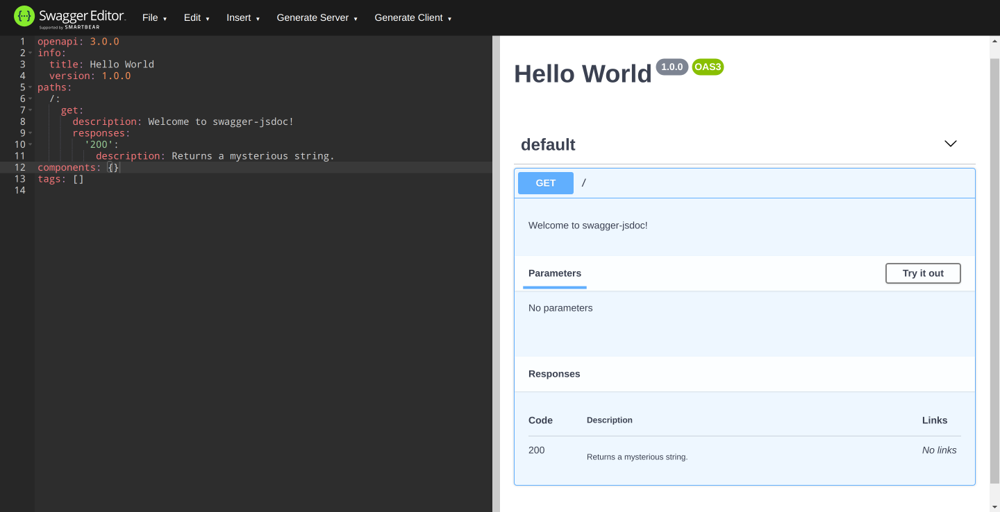

# swagger-jsdoc

This library reads your [JSDoc](https://jsdoc.app/)-annotated source code and generates an [OpenAPI (Swagger) specification](https://swagger.io/specification/).

[](https://www.npmjs.com/package/swagger-jsdoc)


## Getting started

Imagine having API files like these:

```javascript
/**
 * @openapi
 * /:
 *   get:
 *     description: Welcome to swagger-jsdoc!
 *     responses:
 *       200:
 *         description: Returns a mysterious string.
 */
app.get('/', (req, res) => {
  res.send('Hello World!');
});
```

The library will take the contents of `@openapi` (or `@swagger`) with the following configuration:

```javascript
const swaggerJsdoc = require('swagger-jsdoc');

const options = {
  definition: {
    openapi: '3.0.0',
    info: {
      title: 'Hello World',
      version: '1.0.0',
    },
  },
  apis: ['./src/routes*.js'], // files containing annotations as above
};

const openapiSpecification = swaggerJsdoc(options);
```

The resulting `openapiSpecification` will be a [swagger tools](https://swagger.io/tools/)-compatible (and validated) specification.



## Node.js version requirements, CommonJS and ESM

`swagger-jsdoc` 6.x requires Node.js 12.x and above. When using the CLI, the library will attempt to load the definition file in several formats: `.js`, `.cjs`, `.yaml` (or `.yml`) and `.json`.

The example above follows the CommonJS format, which will work when you do not have `"type": "module"` in your `package.json`.

However, if you're using ESM and have `"type": "module"`, then please change the extension to `.cjs`.

If you need `swagger-jsdoc` to be fully ESM, check out the [7.x](https://github.com/Surnet/swagger-jsdoc/tree/v7) which is currently in a RC version.

## Installation

```bash
npm install swagger-jsdoc --save
```

Or

```bash
yarn add swagger-jsdoc
```

## Supported specifications

- OpenAPI 3.x
- Swagger 2

## Documentation

Detailed documentation is available within [`/docs`](https://github.com/Surnet/swagger-jsdoc/tree/master/docs/README.md) folder.
